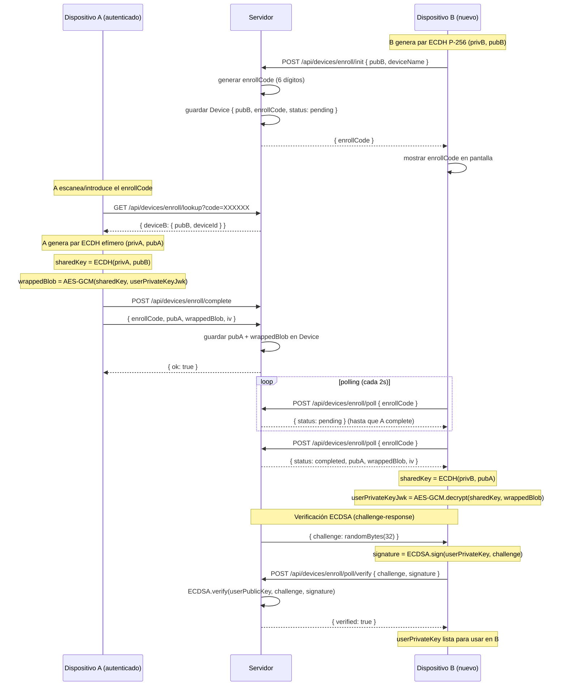

# Architecture — Zero-Knowledge Vault

> Documento de referencia técnica para auditores, inversores y evaluadores.
> Este documento describe la arquitectura del sistema, el modelo de
> amenazas, las limitaciones conocidas y una comparativa honesta contra
> gestores de contraseñas establecidos.

---

## 1. Visión general

Zero-Knowledge Vault es un gestor de contraseñas donde **todo el cifrado
ocurre en el navegador del cliente** usando la Web Crypto API estándar del
W3C. El servidor es un *crypto-blind store* que persiste blobs cifrados,
sales públicas, IVs y llaves públicas — **nunca** recibe contraseñas
maestras, llaves privadas en claro, ni el contenido de ningún secreto.

### Componentes

- **Cliente (navegador)**: React 19 + Next.js 16. Toda la criptografía
  ocurre aquí vía `crypto.subtle`.
- **Servidor (Next.js API routes)**: 18 endpoints REST que solo almacenan
  y sirven blobs cifrados. Verifica firmas PoP y challenge-response pero
  nunca descifra nada.
- **Base de datos**: SQLite (dev) o PostgreSQL (prod) via Prisma. 6
  modelos: User, UserKeyMaterial, Secret, SecretKeyShare, Device, AuditLog.
- **Cache distribuido**: Redis opcional para rate-limiting y blacklist de
  tokens de sesión. Fallback a `Map` in-memory en desarrollo.

---

## 2. Stack criptográfico

| Capa | Algoritmo | Parámetros | Uso |
|------|-----------|-----------|-----|
| KDF primario | **Argon2id** | m=64MiB, t=3, p=4 | Derivar masterKey de la contraseña |
| KDF fallback | PBKDF2-SHA256 | 600,000 iteraciones | Si Web Worker falla |
| Subkey derivation | HKDF-SHA256 | RFC 5869 | audit, device, share, metadata subkeys |
| Cifrado simétrico | **AES-256-GCM** | 96-bit IV, AAD | Cifrar blobs y llaves privadas |
| Wrap asimétrico | RSA-OAEP 2048 | SHA-256 | Envolver llaves AES para shares |
| Firmas | RSA-PSS 2048 | salt=32, SHA-256 | Proof-of-Possession en registro |
| Multi-device | ECDH P-256 | — | Derivar shared key entre dispositivos |
| Device enrollment | ECDSA P-256 | SHA-256 | Challenge-response |
| Post-cuántico | **ML-KEM-768** | NIST FIPS 203 | Hybrid KEM con ECDH para shares futuros |
| Recovery | BIP-39 | 24 palabras, 256 bits | Backup de la llave privada RSA |
| Audit chain | SHA-256 hash chain | — | Tamper-evident audit logs |

**Estándares cumplidos:** Web Crypto API (W3C), RFC 5869 (HKDF),
RFC 8017 (RSA-OAEP/PSS), NIST FIPS 203 (ML-KEM-768), BIP-39.

---

## 3. Modelo de datos (6 entidades)

```
User
  ├─ UserKeyMaterial (1:1)  — kdfSalt, publicKeyJwk, encryptedPrivateKeyJwk,
  │                           mlKemPublicKey, recoveryKey
  ├─ Secret[] (1:N)          — encryptedTitle, encryptedData, IVs
  │    └─ SecretKeyShare[]   — wrappedSymmetricKey (RSA-OAEP)
  ├─ Device[] (1:N)          — publicKeyECDH, wrappedPrivateKeyForDevice
  └─ AuditLog[] (1:N)        — encryptedEvent, prevHash, logHash
```

**Propiedad fundamental verificada:** el servidor nunca almacena
contraseña maestra, masterKey, llave privada RSA en claro, llaves AES
simétricas, contenido de secretos, ni frase BIP-39.

---

## 4. Diagrama de flujo — Registro

```
Cliente                                      Servidor
  │                                            │
  ├─ generar par RSA-2048                      │
  ├─ generar par ECDH P-256                    │
  ├─ generar par ML-KEM-768                    │
  ├─ derivar kdfSalt (16 bytes aleatorios)     │
  ├─ Argon2id(password, kdfSalt) → masterKey   │
  ├─ AES-GCM(masterKey, privateKeyJwk) → blob  │
  ├─ RSA-PSS(privateKey, {email, fp, salt})    │
  │                                            │
  ├─ POST /api/auth/register ─────────────────►│
  │   body: { email, kdfSalt, kdfParams,       │
  │           publicKeyJwk, encryptedPrivJwk,   │
  │           privateKeyIv, popSignature,       │
  │           mlKemPublicKey,                   │
  │           encryptedMlKemPrivateKey }        │
  │                                            │
  │                                            ├─ validar Zod schema
  │                                            ├─ verificar PoP signature
  │                                            ├─ calcular fingerprint
  │                                            ├─ crear User + UserKeyMaterial
  │◄────────────────── { userId, email, fp } ──┤
```

---

## 5. Diagrama de flujo — Multi-device enrollment (ECDH + ECDSA)



**Propiedad clave:** el servidor nunca ve `sharedKey` ni
`userPrivateKeyJwk` — ambas existen solo en los dos dispositivos. El
servidor solo ve `pubA`, `pubB` (públicas) y `wrappedBlob` (cifrado).

---

## 6. Modelo de amenazas (Threat Model)

### 6.1 Activos protegidos

| Activo | Cómo se protege | Estado |
|--------|----------------|--------|
| Contraseña maestra | Nunca sale del cliente; solo se usa para derivar masterKey | ✓ Implementado |
| Llave maestra (masterKey) | CryptoKey non-extractable en memoria; no se persiste | ✓ Implementado |
| Llave privada RSA | Cifrada con AES-256-GCM(masterKey) antes de enviar al server | ✓ Implementado |
| Llaves AES simétricas | Envueltas con RSA-OAEP(publicKey del destinatario) | ✓ Implementado |
| Contenido de secretos | AES-256-GCM con IV aleatorio 96-bit + AAD opcional | ✓ Implementado |
| Frase BIP-39 recovery | Nunca se envía al server; solo se muestra una vez al usuario | ✓ Implementado |
| Contenido de audit logs | AES-256-GCM con audit subkey (HKDF derivada) | ✓ Implementado |
| Session tokens | HS256 con jti + blacklist server-side (Redis o Map) | ✓ Implementado |

### 6.2 Adversarios considerados

| Adversario | Capacidad | Mitigación | Estado |
|------------|-----------|------------|--------|
| **Red pasiva** (MITM HTTPS) | Intercepta tráfico | TLS 1.3 + HSTS preload | ✓ |
| **Red activa** (MITM modifica) | Modifica requests | PoP signature en registro; HS256 en session tokens | ✓ |
| **Servidor comprometido** | Operador malicioso con acceso a BD | Zero-knowledge: BD solo tiene blobs cifrados | ✓ |
| **Cliente comprometido** (XSS/malware) | Ejecuta código en navegador | Memory zeroing; CSP estricta; no `window` globals | ⚠️ Parcial |
| **Admin comprometido** | Acceso a endpoints admin | Rate-limiting; audit logs tamper-evident | ✓ |
| **Atacante post-cuántico** | Harvest-now-decrypt-later | ML-KEM-768 en shares (hybrid con ECDH) | ✓ |
| **Atacante con DB dump** | Tiene todos los blobs cifrados | Argon2id (64 MiB) hace brute-force costoso | ✓ |
| **Atacante con fuente** | Inspecciona código | Open source MIT; sin secretos hardcodeados | ✓ |

### 6.3 Qué protege el esquema Zero-Knowledge

El esquema **sí protege**:

1. **Contenido de secretos** — el servidor solo ve ciphertext AES-256-GCM.
2. **Contraseña maestra** — nunca sale del cliente.
3. **Llave privada RSA** — cifrada con masterKey antes de enviar.
4. **Llaves AES simétricas** — envueltas con RSA-OAEP.
5. **Frase BIP-39** — nunca se envía al server.
6. **Audit log content** — cifrado con audit subkey.

### 6.4 Qué NO protege el esquema Zero-Knowledge

El esquema **NO protege** (limitaciones fundamentales):

1. **Metadatos de acceso** — el servidor sabe qué usuario accede a qué
   secreto y cuándo (timestamps, IPs, user-agents). Esto es necesario
   para el funcionamiento del sistema.
2. **Análisis de tiempos de petición** — un atacante que controle el
   servidor puede inferir patrones de uso (ej. "Alice accede al secreto
   X cada mañana a las 9am").
3. **Tamaño de secretos** — el ciphertext revela el tamaño aproximado
   del plaintext (con overhead de GCM tag + IV).
4. **Grafo de shares** — el servidor sabe quién compartió con quién
   (aunque no el contenido).
5. **Cliente totalmente comprometido** — si un atacante ejecuta código
   arbitrario en el navegador del usuario (XSS exitoso), puede robar la
   masterKey de memoria, los secretos descifrados, etc. La defensa es
   CSP estricta + revisión de dependencias, pero no es infalible.
6. **Ataques de canal lateral en el navegador** — timing attacks,
   Spectre/Meltdown si el navegador es vulnerable.
7. **Pérdida de la frase BIP-39** — si el usuario olvida su contraseña
   maestra Y pierde la frase BIP-39, la bóveda es irrecuperable. No hay
   backdoor.

---

## 7. Limitaciones conocidas (Known Limitations)

### 7.1 Limitaciones técnicas

1. **Sin apps móviles nativas** — solo web. Roadmap v1.1: React Native.
2. **Sin extensión de navegador** — no autocompletado en forms. Roadmap v1.1.
3. **Sin SSO/SAML/SCIM** — crítico para enterprise. Roadmap v1.3.
4. **Sin auditoría externa** — no se ha auditado por Cure53/Trail of Bits.
5. **Sin monitoreo en producción** — pino logger listo pero sin backend
   (Sentry/Loki/Grafana pendiente).
6. **Argon2id en Web Worker** — requiere WebAssembly; navegadores viejos
   (IE, Safari < 15) no soportados. Fallback a PBKDF2.
7. **ML-KEM-768 es experimental** — NIST FIPS 203 publicado en 2024 pero
   la adopción es reciente. Puede haber cambios en implementaciones
   futuras que requieran re-cifrado.
8. **Cobertura de tests en client.ts: 51%** — los paths de Argon2id
   worker solo se ejercen en navegador real. Tests E2E con Playwright
   cubren esto parcialmente.
9. **Sin soporte offline** — todos los endpoints requieren red. Roadmap
   v1.2: cache local cifrado.

### 7.2 Limitaciones de UX

1. **Registro lento** — Argon2id (64 MiB) tarda 1-3s en hardware
   moderno. Mostramos spinner pero no se puede evitar.
2. **No autocompletado en forms** — sin extensión, el usuario debe
   copiar/pegar manualmente.
3. **No importación desde otros gestores** — sin migrador desde
   1Password/Bitwarden/LastPass. Roadmap v1.1.
4. **No team vaults** — solo shares individuales. Roadmap v1.2.
5. **No roles granulares** — solo "admin" y "readonly". Roadmap v1.2.

### 7.3 Limitaciones de compliance

1. **Sin SOC2 Type II** — necesario para enterprise sales. Costo: USD 30-80K.
2. **Sin ISO 27001** — necesario para algunos mercados.
3. **GDPR parcial** — crypto-shredding (Art. 17) y exportación (Art. 20)
   implementados, pero sin DPA formal ni registro de procesamiento.
4. **Sin HIPAA** — no aplicable (no almacena PHI).
5. **Sin FedRAMP** — no es govtech.

---

## 8. Comparativa con gestores tradicionales

### 8.1 Tabla comparativa

| Feature | ZK Vault | Bitwarden | 1Password | Proton Pass | KeePassXC |
|---------|----------|-----------|-----------|-------------|-----------|
| Zero-knowledge | ✓ estricto | ✓ | ✓ | ✓ | ✓ (local) |
| Open source | ✓ MIT | ✓ GPL | ✗ | ✓ AGPL | ✓ GPL |
| Self-hosted | ✓ | ✓ | ✗ | ✗ | ✓ (local) |
| Post-cuántico (ML-KEM) | **✓ activo** | roadmap | roadmap | ✗ | ✗ |
| Audit log tamper-evident | ✓ hash chain | ✗ | ✓ | ✗ | ✗ |
| Multi-device ECDH | ✓ P-256 | ✓ | ✓ (own) | ✓ | ✗ |
| BIP-39 recovery | ✓ 24 palabras | ✓ | ✗ (own) | ✓ | ✗ |
| Argon2id KDF | ✓ 64 MiB | ✓ | ✓ (own) | ✓ | ✓ |
| Apps móviles | ✗ roadmap | ✓ | ✓ | ✓ | ✗ |
| Extensión navegador | ✗ roadmap | ✓ | ✓ | ✓ | ✗ |
| SSO/SAML | ✗ roadmap | ✓ enterprise | ✓ enterprise | ✗ | ✗ |
| SCIM provisioning | ✗ roadmap | ✓ enterprise | ✓ enterprise | ✗ | ✗ |
| Auditoría externa | ✗ pendiente | ✓ Cure53 | ✓ múltiples | ✓ | ✗ |
| Equipos (team vaults) | ✗ roadmap | ✓ | ✓ | ✓ | ✗ |
| Free tier | ✓ (planeado) | ✓ | ✗ | ✓ | ✓ (gratis) |
| Precio Pro | $3/mes (planeado) | $1/mes | $3/mes | $2/mes | gratis |

### 8.2 Análisis del esquema híbrido post-cuántico

**Ventajas del enfoque de ZK Vault:**

1. **Defensa contra harvest-now-decrypt-later** — un atacante que grabe
   tráfico cifrado hoy no podrá descifrarlo cuando tenga una computadora
   cuántica en el futuro, porque los shares usan ML-KEM-768.
2. **Hybrid con ECDH clásico** — si ML-KEM-768 resulta vulnerable en el
   futuro, el ECDH P-256 clásico sigue protegiendo los shares. Esto es
   "defense in depth" post-cuántica.
3. **Estándar NIST FIPS 203** — ML-KEM-768 es el estándar oficial
   post-cuántico de EEUU (agosto 2024).

**Desventajas:**

1. **Overhead de tamaño** — las llaves públicas ML-KEM-768 son 1184 bytes
   vs 256 bytes de ECDH P-256. Cada `UserKeyMaterial` es más grande.
2. **Overhead de cómputo** — encaps/decaps ML-KEM agrega ~5-10ms por
   operación. Imperceptible para el usuario pero medible.
3. **Madurez** — ML-KEM es nuevo (estándar 2024). Puede haber bugs en
   implementaciones que se descubran en los próximos años.
4. **No es end-to-end post-cuántico** — solo los shares usan ML-KEM. La
   masterKey deriva de Argon2id (clásico), la privateKey RSA es
   clásica. Un atacante cuántico podría romper RSA y derivar la
   privateKey. Para full post-cuántico se necesitaría migrar a
   Dilithium/Kyber también para firmas.

### 8.3 Rendimiento práctico

| Operación | ZK Vault | Bitwarden | 1Password |
|-----------|----------|-----------|-----------|
| Registro (incluye Argon2id) | 1-3s | 1-2s | <1s (own KDF) |
| Login | 1-3s | 1-2s | <1s |
| Crear secreto | <100ms | <100ms | <100ms |
| Descifrar secreto | <50ms | <50ms | <50ms |
| Compartir (RSA-OAEP wrap) | <200ms | <200ms | <200ms |
| Compartir (ML-KEM hybrid) | <250ms | N/A | N/A |

El overhead de ML-KEM es de ~50ms por share — imperceptible para el
usuario pero medible en benchmarks.

---

## 9. Flujo de rotación de contraseña maestra

```
Cliente                                      Servidor
  │                                            │
  │  1. Pedir al usuario password actual       │
  │  2. Derivar oldMasterKey via Argon2id      │
  │  3. Descifrar privateKey RSA con oldMaster │
  │  4. Pedir newPassword al usuario           │
  │  5. Derivar newMasterKey via Argon2id      │
  │     (con nuevo salt aleatorio)             │
  │  6. Re-cifrar privateKey con newMasterKey  │
  │  7. Firmar PoP con privateKey (no cambió)  │
  │     sobre {email, fingerprint, newSalt}    │
  │                                            │
  ├─ POST /api/auth/rotate ───────────────────►│
  │   body: { newKdfSalt, newKdfIterations,    │
  │           newEncryptedPrivateKeyJwk,        │
  │           newPrivateKeyIv, newPopSignature }│
  │                                            │
  │                                            ├─ verificar PoP con publicKey ACTUAL
  │                                            ├─ verificar fingerprint sin cambios
  │                                            ├─ actualizar UserKeyMaterial
  │                                            ├─ BLOQUE 2: invalidar todos los
  │                                            │  session tokens del usuario (jti)
  │                                            │
  │◄──────────────── { rotated: true } ────────┤
  │                                            │
  │  Cliente debe re-login en TODOS los        │
  │  dispositivos (tokens invalidados)         │
```

**Crítico:** la publicKey RSA **NO cambia** en rotación de contraseña.
Solo cambia la masterKey que la cifra. Las wrappedKeys y shares
existentes siguen siendo válidas. Esto es eficiente pero significa que
rotar la contraseña NO protege contra un atacante que ya tenga la
publicKey (que es pública por diseño).

---

## 10. Flujo de audit log tamper-evident

```
Cliente                                      Servidor
  │                                            │
  │  Para cada acción (create, share, login):  │
  │  1. Construir event JSON                   │
  │     { type, timestamp, secretId, ip, ... } │
  │  2. Derivar auditKey = HKDF(masterKey,     │
  │     "audit")                               │
  │  3. Cifrar event con AES-GCM(auditKey)     │
  │     → encryptedEvent, eventIv              │
  │                                            │
  ├─ POST /api/audit-logs ────────────────────►│
  │   body: { encryptedEvent, eventIv,         │
  │           eventCategory }                  │
  │                                            │
  │                                            ├─ obtener lastLog.logHash del usuario
  │                                            ├─ prevHash = lastLog.logHash ?? null
  │                                            ├─ logHash = SHA-256(prevHash +
  │                                            │     encryptedEvent + eventIv + createdAt)
  │                                            ├─ insert AuditLog { encryptedEvent,
  │                                            │   eventIv, eventCategory, prevHash, logHash }
  │                                            │
  │◄──────────────── { logId, createdAt } ─────┤

  Verificación de integridad:
  │                                            │
  ├─ GET /api/audit-logs/verify ──────────────►│
  │                                            │
  │                                            ├─ fetch all logs ordenados por createdAt ASC
  │                                            ├─ para cada log i:
  │                                            │   - verificar log[i].prevHash === log[i-1].logHash
  │                                            │   - verificar log[i].logHash === SHA-256(...)
  │                                            │   - si cualquier check falla → reportar índice
  │                                            │
  │◄──────── { ok: true|false,                │
  │            firstBrokenIndex: number|null } ┤
```

**Propiedad:** si un admin malicioso modifica un log en la BD, el hash
chain se rompe y `/api/audit-logs/verify` lo detecta. El admin no puede
re-computar los hashes porque no tiene `auditKey` (que se deriva de
`masterKey` del usuario, que el servidor nunca ve).

---

## 11. Stack tecnológico

| Capa | Tecnología | Versión |
|------|------------|---------|
| Frontend | Next.js + React | 16 + 19 |
| Styling | Tailwind CSS | 4 |
| UI components | shadcn/ui (Radix) | 48 componentes |
| Backend | Next.js API routes (Node.js) | 16 |
| ORM | Prisma | 6 |
| DB | SQLite (dev) / PostgreSQL (prod) | — |
| Cache | Redis (opcional) | 7+ |
| Logger | pino (con redacción) | 9 |
| Tests | Vitest + Playwright | 4 + 1.x |
| Crypto | Web Crypto API + hash-wasm + @noble/post-quantum | — |
| Package manager | Bun | 1.3+ |
| TypeScript | 5 |

---

## 12. Referencias

- [Web Crypto API (W3C)](https://www.w3.org/TR/WebCryptoAPI/)
- [RFC 5869 — HKDF](https://datatracker.ietf.org/doc/html/rfc5869)
- [RFC 8017 — RSA-OAEP/PSS](https://datatracker.ietf.org/doc/html/rfc8017)
- [NIST FIPS 203 — ML-KEM](https://csrc.nist.gov/pubs/fips/203/final)
- [BIP-39 — Mnemonic code](https://github.com/bitcoin/bips/blob/master/bip-0039.mediawiki)
- [OWASP Password Storage Cheat Sheet](https://cheatsheetseries.owasp.org/cheatsheets/Password_Storage_Cheat_Sheet.html)
- [OWASP Cryptographic Storage Cheat Sheet](https://cheatsheetseries.owasp.org/cheatsheets/Cryptographic_Storage_Cheat_Sheet.html)
