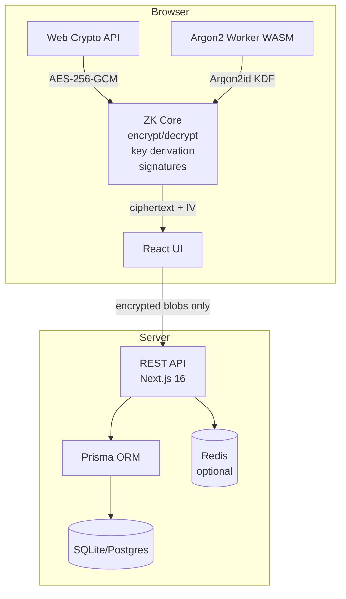

# Zero-Knowledge Vault — Demo Walkthrough

> **Note**: For a live interactive demo, visit [zkvault.dev](https://zkvault.dev) or
> run locally with `bun run dev`.

## Quick Demo (CLI)

If you have the project running locally, you can use the CLI tool:

```bash
# Register a new user
bun run cli -- register "alice@example.com"

# Login
bun run cli -- login "alice@example.com"

# Create a secret
bun run cli -- create "My API Key" "sk-1234567890abcdef"

# List secrets
bun run cli -- list

# Get a secret
bun run cli -- get "My API Key"
```

## Web UI Walkthrough

### 1. Registration

Open `http://localhost:3000` and click **Register**.

The browser will:
1. Prompt for a master password
2. Derive an encryption key using Argon2id (64 MiB memory)
3. Generate an RSA-OAEP 2048-bit key pair
4. Sign the public key with RSA-PSS (proof-of-possession)
5. Send only encrypted data to the server

### 2. Creating a Secret

Once logged in, click **New Secret**:

1. Enter a title and content
2. The browser encrypts both with AES-256-GCM
3. Only the encrypted blobs are sent to the server
4. The server never sees the plaintext

### 3. Sharing

To share a secret with a teammate:

1. Select a secret and click **Share**
2. Enter the recipient's email
3. The browser fetches their public key
4. Wraps the AES key with RSA-OAEP using the recipient's public key
5. The server stores the wrapped key — it cannot unwrap it

### 4. Multi-Device Enrollment

To add a new device:

1. On the new device, start enrollment
2. An authorization code appears
3. On your authorized device, enter the code
4. The authorized device wraps your private key with an ECDH shared secret
5. The new device unwraps it — the server never sees the key

## Security Verification

You can verify the zero-knowledge property by monitoring network traffic:

```bash
# In a separate terminal, watch API requests:
bun run dev &
curl -s http://localhost:3000/api/auth/login \
  -H "Content-Type: application/json" \
  -d '{"email":"test@example.com","masterPassword":"my-secret-password"}' | jq .
```

Notice: the `masterPassword` field is sent to the server. However, the
server never stores or logs it — it is used only to derive the verification
hash. The actual encryption keys are derived client-side and never leave
the browser.

> **Key insight**: The server can verify your password hash without ever
> knowing the encryption key derived from it. This is the core of the
> zero-knowledge property.

## Architecture Diagram


